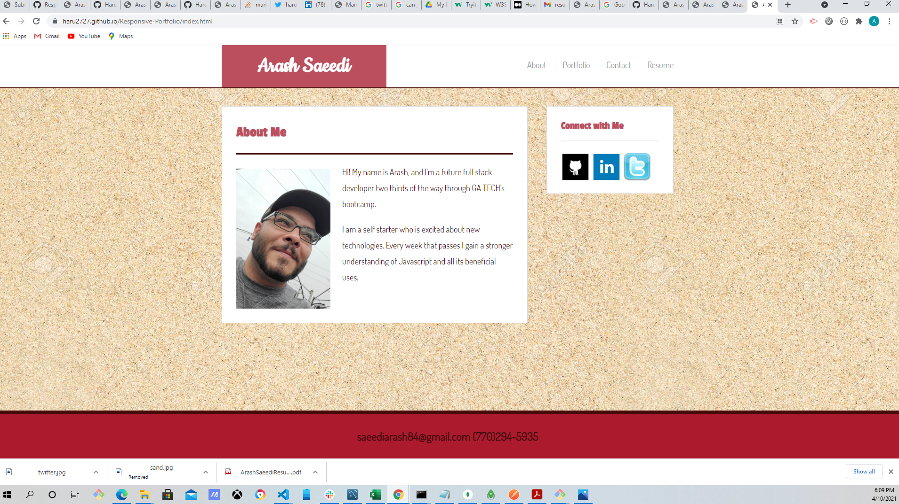
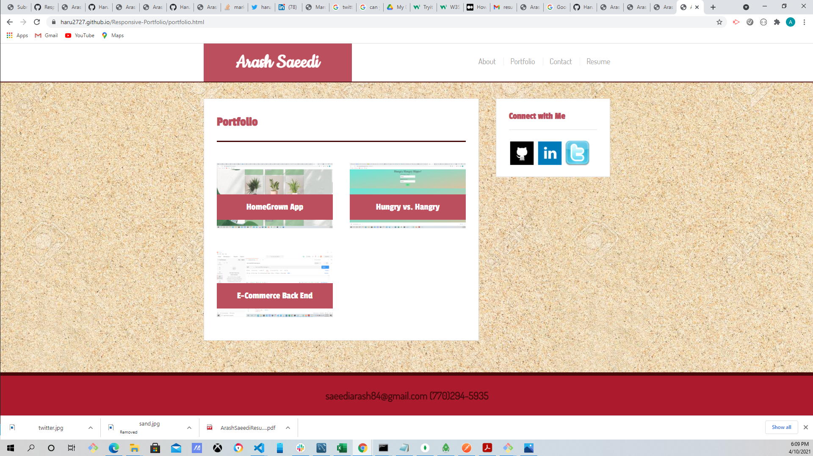
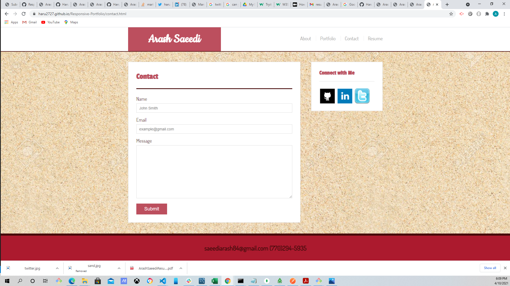

# <h1 align="center"> Responsive-Portfolio</h1>

## Badges
    

## Description

    I created my portfolio in order to showcase my abilities as a web developer and to be able to present myself in a professional manner.

 

## Table of Contents

- [Description](#description)
- [Installation](#installation)
- [Usage](#usage)
- [License](#license)
- [Contributing](#contributing)
- [Tests](#tests)
- [Questions](#questions)

## Installation

    This is not an app that needs installing

## Usgae

    The use of this is to inform potenial employers of my skills and ambitions.

## Contribution

    I forked a repo from github which is indicated on my page. 

## License

  This application uses the MIT license, click on the badge to see the legal notice.  

## Test

    

## Questions

    If you have any questions please feel free to email me or contact me on Github.  My email is saeediarash84@gmail.com, my github username is Haru2727, follow the links below for them.

<a href="mailto:saeediarash84@gmail.com">Email</a>
[Github](https://github.com/Haru2727)

